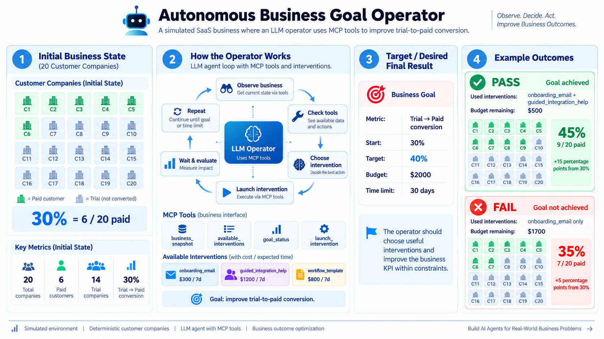

# GoalOps — Autonomous Business Goal Operator

The project is about an experimental autonomous-agent system that operates a **simulated B2B SaaS business** to achieve a measurable business goal.

GoalOps separates the system into three parts:

1. **Agent** — decides what action to take.
2. **Simulation environment** — We define some actions(not unlimited) and their definition, ie how our business will be affected by these actions
3. **Evaluator** — objectively measures what happened.

The operator interacts with the simulated business through **MCP tools**.

The current benchmark goal is:

> **Increase trial-to-paid conversion to at least 40% within 30 simulated days and within a $2,000 intervention budget.**

### In one line: "I have 20 customers(companies here), only 30% of them are getting converted from trial version to paid version, How to increase that number to 40% within 30 days by spending maximum $2000"

---

## Why this project?

We know LLMs can "understand" text very well. We can leverage it and make it select what actions to take to reach to our goals, then calculating what were the results of  those actions(This step is not done by LLM, as we will decide what actually happened, LLM can falsely justify it's actions), feed back the aftermath of those actions to the LLM and so on until it either achieves the goal or fails to achieve it.

It therefore can be called Autonomous(ofcourse with limited "freedom").
We have not made 100s of tools as that would be not be feasable for one person to complete, but the design choices and ideas are sufficient to solve the small problem 


The simulated environment makes experiments reproducible while keeping the consequences of actions under programmatic control.

---

## Architecture

```text
                         ┌──────────────────────┐
                         │   Business Goal       │
                         │                      │
                         │ 40% conversion       │
                         │ 30-day deadline      │
                         │ $2,000 max budget    │
                         └──────────┬───────────┘
                                    │
                                    ▼
                         ┌──────────────────────┐
                         │   Autonomous LLM     │
                         │      Operator        │
                         │                      │
                         │ Observe → Decide     │
                         │ → Act → Observe      │
                         └──────────┬───────────┘
                                    │
                              MCP tools
                                    │
                                    ▼
                         ┌──────────────────────┐
                         │    MCP Server        │
                         │                      │
                         │ business_snapshot   │
                         │ available_interventions
                         │ run_intervention     │
                         │ advance_time         │
                         │ goal_status          │
                         └──────────┬───────────┘
                                    │
                                    ▼
                    ┌──────────────────────────────┐
                    │     Simulation Environment   │
                    │                              │
                    │ Customers                    │
                    │ Events                       │
                    │ Support tickets              │
                    │ Hidden customer traits        │
                    │ Intervention effects          │
                    └──────────────┬───────────────┘
                                   │
                                   ▼
                         ┌──────────────────────┐
                         │ PostgreSQL           │
                         │                      │
                         │ Runs                 │
                         │ Customers            │
                         │ Events               │
                         │ Interventions        │
                         │ Operator sessions    │
                         │ Tool calls            │
                         └──────────┬───────────┘
                                    │
                                    ▼
                         ┌──────────────────────┐
                         │ Deterministic        │
                         │ Evaluation            │
                         │                      │
                         │ Goal result          │
                         │ Cost                 │
                         │ Time                 │
                         │ Actions              │
                         │ Inspection behavior  │
                         └──────────────────────┘
```


## How an operator run works

A typical MCP-native run follows this loop:

```text
Create SimulationRun
        │
        ▼
Check objective goal status
        │
        ▼
LLM receives observable business state
        │
        ▼
LLM requests MCP tool call(s)
        │
        ▼
Application executes the tool through MCP
        │
        ▼
Tool result is persisted
        │
        ▼
Result is returned to the LLM
        │
        ▼
LLM decides what to do next
        │
        ├── inspect business
        ├── inspect interventions
        ├── launch intervention
        ├── advance simulated time
        └── check goal
        │
        ▼
Goal achieved / failed / execution limit
```



---

## The simulated business

We seed 20 customer companies(of our business) in our simulation, they are like this:

- **6 activated companies** — already completed onboarding and became paid.
- **8 stalled trial companies** — started onboarding but are stuck, with integration-related support problems.
- **6 inactive trial companies** — started trials but have very little product usage.

The customer data includes:

- company segment and status,
- subscriptions,
- company lifecycle events,
- support tickets,
- hidden simulation profiles.

### Observable vs hidden information

The operator can observe business evidence such as:

- conversion rate,
- onboarding funnel,
- product usage,
- support-ticket summaries,
- current simulated day,
- spending,
- intervention history.

Not all customer companies act the same way, the simulator also stores hidden customer traits:

- `intent_score`
- `engagement_score`
- `integration_difficulty`

These hidden traits influence simulation outcomes but are deliberately not exposed to the operator.

The operator therefore has to reason from observable business evidence rather than receiving the simulator's underlying causal parameters directly.

---

## Interventions

Because we don't want to create too much complexity, our current intervention registry contains three predefined actions:

| Intervention | Cost | Duration | Main effect |
|---|---:|---:|---|
| `guided_integration_help` | $1,200 | 7 days | Helps trial companies with integration problems |
| `onboarding_email` | $300 | 7 days | Additional onboarding guidance |
| `workflow_template` | $800 | 7 days | Helps trial companies reach activation faster |

The LLM cannot invent arbitrary interventions because it doesn't have full freedom.

It receives the available intervention definitions through MCP and can only request approved actions.

The simulation engine determines the eventual outcome after LLM chooses the interventions.

---

## MCP architecture

GoalOps uses MCP as the boundary between the autonomous operator and the business environment.

The MCP server exposes:

```text
business_snapshot
create_run
available_interventions
run_intervention
advance_time
goal_status
```

The operator discovers the available MCP tools and converts their definitions into the format required by the Groq tool-calling API.

Conceptually:

```text
                    LLM
                     │
              tool request
                     │
                     ▼
              MCP client
                     │
                     ▼
              MCP server
                     │
                     ▼
          application tool layer
                     │
          ┌──────────┴──────────┐
          ▼                     ▼
     analytics             simulation
          │                     │
          └──────────┬──────────┘
                     ▼
                 PostgreSQL
```

This means the operator does not need direct access to:

- SQLAlchemy sessions,
- database tables,
- analytics implementation,
- simulation internals.

MCP provides the tool interface through which the agent interacts with the environment.

---

## Persistence and simulation runs

We can't run the operator once and if it succeds call it a day, we need multiple runs. It will also tell when the operator fails to achieve the goal what were the reasons

A `SimulationRun` represents one independent simulated business world.

It stores persistent simulation-level state such as:

- run ID,
- current simulated day,
- total intervention spend,
- random seed,
- lifecycle status.

`SimulationState` is the Python representation used by the simulation engine:

- current simulated day,
- active interventions,
- total spend,
- random seed.

The persistence layer converts between the in-memory `SimulationState` and database-backed `SimulationRun` / intervention records.

This separation allows the simulation engine to work with a simple state object while allowing runs to survive process boundaries and application restarts.

### Operator sessions

A simulation run can contain multiple `OperatorSession` records.

This allows an operator run to be stopped and later resumed without creating a new business world.

Each session records its own termination reason and completion time.

### Tool-call history

Every MCP tool call made by the operator is persisted in `OperatorToolCall`.

This provides a reconstructable record of what the operator actually did across sessions.

---

## Goal definition and evaluation

Goals are explicitly represented by `BusinessGoal`:

```text
metric_name
target_value
deadline_day
max_budget
```

The current benchmark goal is:

```text
metric_name  = trial_to_paid_conversion
target_value = 40.0
deadline_day = 30
max_budget   = 2000.0
```

`GoalStatus` has three states:

```text
in_progress
achieved
failed
```

`GoalEvaluation` is the deterministic result of evaluating the current goal state.

The goal evaluator checks:

1. whether spending exceeded the budget,
2. whether the target metric has been reached,
3. whether the deadline has passed,
4. otherwise, whether the goal remains in progress.

The evaluator does not ask the LLM whether it succeeded, because LLM can't be trusted for it's own evaluation.

For example, the LLM may say:

```text
"Goal achieved."
```

but the application independently calls `goal_status` and evaluates the actual simulated business state.

---

## Run-level evaluation

`SimulationRunEvaluation` summarizes a complete simulation run.

It records:

- goal status,
- final metric,
- target value,
- total spend,
- simulated days used,
- number of recorded operator tool calls,
- interventions launched,
- whether the business was inspected,
- whether inspection happened before the first intervention,
- number of operator sessions,
- number of resumes,
- termination history.

This makes evaluation based on persisted system state rather than on the LLM's self-report.

---

## Benchmarking

The benchmark runs the operator independently across multiple random seeds.

Each seed creates a new isolated `SimulationRun`.

`BenchmarkRunResult` represents one seed's result.

`BenchmarkResult` aggregates the benchmark:

- total runs,
- successful runs,
- failed runs,
- in-progress runs,
- execution errors,
- success rate,
- average final metric,
- average spend,
- average days used,
- average tool calls,
- business-inspection rate,
- inspection-before-action rate,
- average operator sessions,
- average resumes,
- termination counts,
- intervention counts,
- individual run results.

Importantly:

```text
execution_status = "completed"
```

means the benchmark/operator execution completed without a technical exception.

It does **not** mean that the business goal was achieved.

Business success is represented separately by:

```text
evaluation.goal_status
```

This distinction allows a legitimate business failure to remain different from an infrastructure/runtime failure.

---

## Example benchmark

A 10-seed benchmark produced the following aggregate result during development:

```text
Total runs:                    10
Successful business runs:      9
Execution errors:              1
Success rate:                  90.0%

Average final metric:          46.11%
Average spend:                 $1,266.67
Average days used:             7.78
Average tool calls:            6.78

Business inspected:            100%
Inspected before action:       100%

Average operator sessions:      1.0
Average resumes:               0.0
```

The benchmark also showed different strategies across seeds. For example, some successful runs reached the target with only `onboarding_email`, while others used both `guided_integration_help` and `onboarding_email`.

A separate seed-5 run demonstrated a legitimate business failure:

```text
final conversion: 35%
target:            40%
spend:             $2,000
simulated day:     30
status:            failed
```

This is useful because the simulator is not designed to guarantee that the operator always succeeds.

### What the benchmark does and does not prove

The current benchmark demonstrates autonomous goal pursuit and measurable operational behavior **inside this simulation**.

It does **not** establish causal business lift relative to a no-intervention control condition.

That is an important limitation of the current evaluation methodology.

---


---

## Database model

The main database entities are:

```text
SimulationRun
    │
    ├── Customers
    │      ├── Users
    │      ├── CustomerEvents
    │      ├── UserEvents
    │      ├── SupportTickets
    │      └── CustomerSimulationProfile
    │
    ├── SimulationRunIntervention
    │
    └── OperatorSession
             │
             └── OperatorToolCall
```


## Reproducibility

Simulation runs use a `random_seed`.

The simulation engine combines the run's seed with intervention evaluation timing when creating its random generator.

This allows benchmark runs to be reproduced for the same seed while still producing stochastic customer outcomes.

---

## Setup

### Requirements

The project currently declares:

- Python `>=3.14`
- PostgreSQL
- Groq API access

Python dependencies are declared in `pyproject.toml`.

### Environment variables

Create a `.env` file containing:

```env
DATABASE_URL=postgresql://<user>:<password>@<host>:<port>/<database>
GROQ_API_KEY=<your-groq-api-key>
GROQ_MODEL=<optional-model-name>
```

`GROQ_MODEL` defaults in the current implementation to:

```text
openai/gpt-oss-20b
```


### Database migrations

After configuring the database:

```bash
alembic upgrade head
```

---

## Seed the simulation data

The demo seeding script creates the deterministic business world used by the simulation.

The script is designed to clear previous demo business data before reseeding it.

Use:

```bash
python -m app.scripts.seed_demo_data
```

---

## Run the operator

The MCP-native operator can be started with:

```bash
python -m app.scripts.run_tool_operator
```

The script creates a new simulation run, executes the autonomous operator, and prints an objective evaluation.

---

## Resume an existing run

The project supports resuming an existing persistent simulation run.

The resume entry point is:

```bash
python -m app.scripts.resume_tool_operator
```

The current development script contains a specific example run ID; update that value before using it for a different persisted run.

---

## Run the benchmark

The benchmark entry point runs seeds `1` through `10` in the current implementation:

```bash
python -m app.scripts.run_benchmark
```

It prints structured JSON containing both aggregate metrics and per-run results.

---

## Run tests

Run the test suite with:

```bash
pytest -q
```

---


---

## What kinds of problems can GoalOps solve?

The architecture is intentionally broader than the current conversion-rate example.

The general problem class is:

> **Given a measurable business objective, an observable business environment, a constrained set of actions, resource limits, and delayed consequences, autonomously choose and sequence actions until the objective is achieved or the constraints make further pursuit impossible.**

The current implementation demonstrates this with:

```text
trial-to-paid conversion
```

The same architecture could eventually support goals such as:

```text
increase activation
reduce churn
increase product adoption
reduce support backlog
improve onboarding completion
increase workflow usage
```

Those are **future extensions**, not metrics currently implemented by the goal evaluator.

---

## Current limitations

We have deliberately created a simulated environment, so its results can't be interpreted as evidence of real-world business performance.

Current limitations include:

- only one goal metric is currently supported by the goal evaluator,
- intervention effects are predefined simulation rules,
- the current benchmark does not provide a no-intervention causal control,
- Due to cost issues, the benchmark is currently small(10 seeds)
- LLM/provider reliability can affect execution,
- the simulation's hidden causal structure is hand-designed which is definitely not the case in real word,
- the current operator's action space is intentionally constrained.

These limitations are part of the experimental design and provide clear directions for future work.

---

## Future directions

Possible extensions include:

- additional business metrics and goals,
- stronger causal/counterfactual evaluation,
- larger benchmark suites,
- more diverse simulated business environments,
- improved intervention selection,
- richer long-horizon planning,
- more sophisticated failure recovery,
- independent evaluation models,
- benchmark result visualization,
- stronger robustness analysis across seeds and environments.

---


